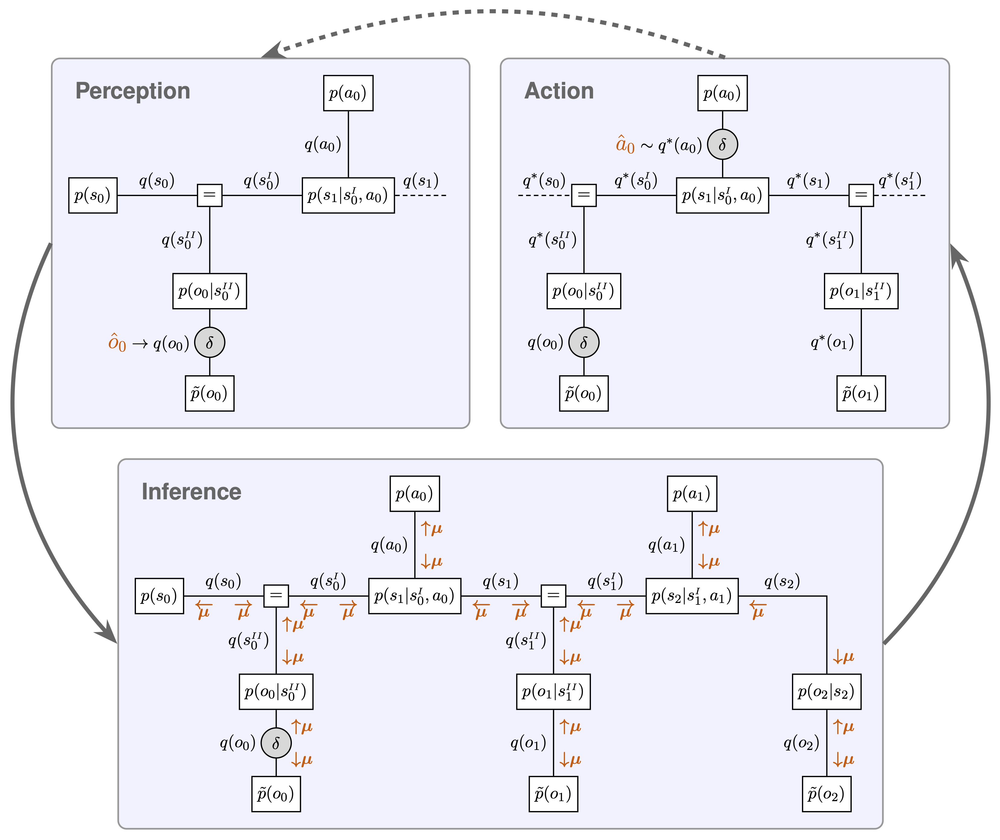
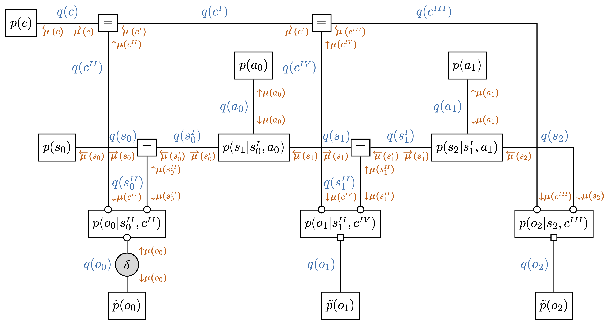

# Contextual Information Seeking for Active Inference

This repository contains my Master's thesis.

**Title:** Contextual Information Seeking for Active Inference  
**Author:** Moritz Glawleschkoff, University of Freiburg  
**First Referee:** Prof. Dr. Stefan Rotter, University of Freiburg  
**Second Referee:** Prof. Dr. Stefan Kiebel, TU Dresden  
**Research Supervisor:** Dr. Sarah Schwöbel, TU Dresden  
**Date:** 9. September 2026  

---

### Abstract
Humans navigate complex environments by abstracting situational details into context states, enabling efficient perception and action. The Free Energy Principle (FEP) provides a framework for understanding this behavior, positing that agents minimize expected free energy, which naturally gives rise to both goal-directed action and information-seeking (curiosity). While epistemic behavior regarding immediate environmental states has been well-studied, contextual information-seeking—where agents actively resolve uncertainty about abstract situational rules—remains underexplored. To investigate these cognitive mechanisms, this thesis develops a computational behavioral model, the Context-GFE agent, capable of actively seeking information about an abstract context state. Grounded in Active Inference and formalized using Forney-style Factor Graphs (FFG), message passing algorithms are derived to enable the unified inference of past, present, and future belief distributions. The newly proposed Context-GFE agent is evaluated against three baseline models (BFE, Context-BFE, and GFE) in a simulated T-maze environment. Results demonstrate that the Context-GFE agent successfully resolves contextual uncertainty by planning ahead to receive informative observations, balancing epistemic and pragmatic drives. Overall, this model provides a mathematically grounded and testable hypothesis for studying contextual abstraction and cognitive control, facilitating future empirical validation through Bayesian model comparison.

---

### Model Architecture & Factor Graphs

#### 1. Perception-Action Loop via Variational Message Passing
The unified operational cycle mapping sensory observation clamping ($\hat{o}_0$), belief propagation across time steps, and future action selection ($\hat{a}_0$) onto Forney-style Factor Graphs:

  

#### 2. Contextual Generative Model & Belief Propagation
The full factorized generative model incorporating abstract context priors $p(c)$, equality constraints, and bidirectional variational message passing ($\vec{\mu}, \overleftarrow{\mu}$) to resolve contextual ambiguity:

  

---

### Reproducibility
* The figures 3.1, 3.2, 3.3, and 3.4 in the thesis can be reproduced in the notebook [`02_final_simulations/experiments.ipynb`](02_final_simulations/experiments.ipynb).
* The compiled thesis PDF is available for direct download in the [Releases section](https://github.com/glawleschkoff/master-thesis/releases/latest).
